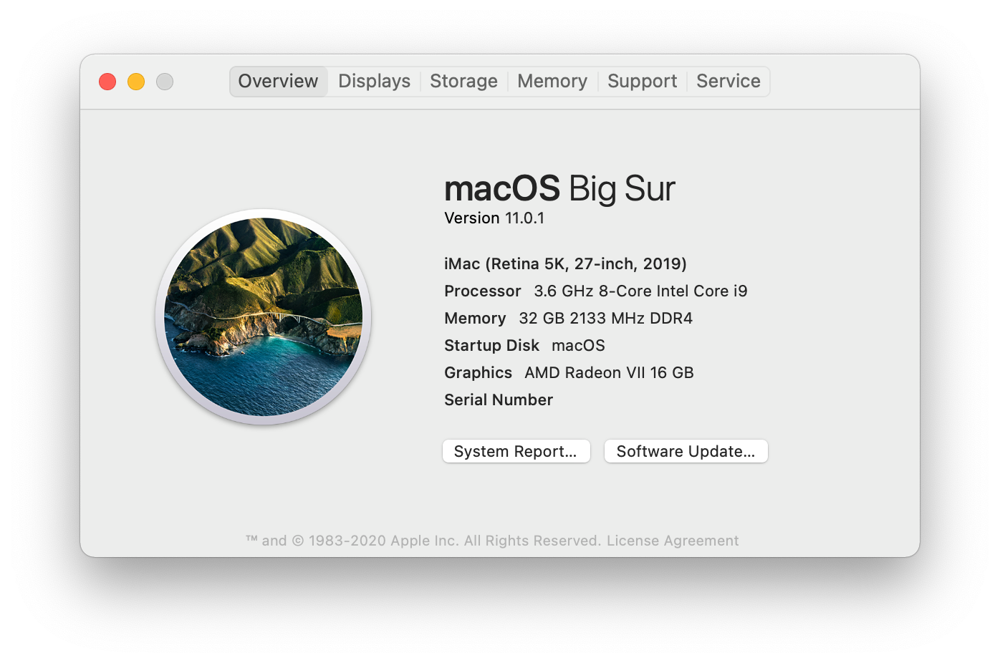

# Gigabyte Designaire Z390 - OpenCore - macOS Catalina

⭐️ **Thank you guys for all the stars!** ⭐️

This guide is using macOS Catalina 10.15.6 (19G73), and OpenCore 0.5.9 with integrated boot selector UI. Currently, debug and verbose mode are disabled. If you have exactly the same hardware as I do, this is probably not an issue. Otherwise, it might be helpful to use the `DEBUG` releases of OpenCorePkg and AppleSupportPkg rather than `RELEASE` the versions included in this EFI. You should also add the `debug=0x100` and `-v` flags to the boot args, as well as follow [other recommendations](https://desktop.dortania.ml/config.plist/coffee-lake.html#nvram) laid out in the [OpenCore Desktop guide](https://desktop.dortania.ml/).

As always, if this repository is more than a few weeks old when you view it, it would probably behoove you to grab the latest versions of the drivers and kernel extensions used in this EFI.

> This EFI is a revision of the [previous Clover EFI](https://github.com/baughmann/Catalina-Gigabyte-Designare-Z390-i9-9900k-EFI) that I posted. Given that OpenCore has a definitive and always-up-to-date installation guide (a much welcome change from Clover), [you should read it](https://dortania.github.io/OpenCore-Desktop-Guide/) in addition to using this EFI.

---

## **Hardware**

#### Primary System

| Component | Product                           |
| --------- | --------------------------------- |
| CPU       | Intel Core i9 9900K               |
| MB        | Gigabyte Designaire Z390 (rev 10) |
| GPU       | AMD Radeon VII 16 GB              |
| SSD       | Samsung EVO 970 (NVMe - 1TB)      |
| BT/Wi-Fi  | Fenvi T919 Bluetooth/Wi-Fi Card   |

#### Verified Secondary System (changes needed)

I can also confirm that this basically also works on my wife's computer whose specs are below. Just remove the `USBPorts.kext` from the `config.plist` and the `kexts` directory and you _should_ be good to go:

| Component | Product                                 |
| --------- | --------------------------------------- |
| CPU       | Intel Core i7 8700K                     |
| MB        | Asus ROG Maximus X Hero (Wi-Fi AC) Z370 |
| GPU       | AMD Radeon VII 16 GB                    |
| SSD       | Samsung 860 EVO SSD (1TB)               |
| BT/Wi-Fi  | Fenvi T919 Bluetooth/Wi-Fi Card         |

#### Other Configurations

I have seen [some users](https://github.com/baughmann/Catalina-Gigabyte-Designare-Z390-i9-9900k-EFI/issues/1) have success without a dedicated GPU. This is important because I believe that the AMD Radeon VII is only going to get harder to find.

Whatever hardware you want to buy, be sure to read the [fantastic Buyer's Guide by Dortania](https://dortania.github.io/GPU-Buyers-Guide/). You will also need to skim/CMD+F the [amazing OpenCore Desktop Guide](https://dortania.github.io/OpenCore-Desktop-Guide/config.plist/coffee-lake.html) to see if it requires any `config.plist` changes.

---

## Functionality

#### **What works**

- Bluetooth & Wi-Fi
- AirDrop and other continuity features
- Audio (rear 3.5mm audio jack works, haven't tested the front)
- Shutdown / Restart / Sleep
- USB 3.0/3/1
- Thunderbold 3 (including charging and hotswapping)
- ~~Emulated NVRAM~~
- NVMe
- APFS (actually, APFS is required for this build)

#### **What doesn't work**

- Emulated NVRAM ☹ (it's a Z390 after all)

## Installation

#### **Customize the `config.plist`**

The following fields have been replaced by `[REPLACME]` (for ease of Cmd+F):

- `config.plist` > `PlatformInfo`
  - `SystemSerialNumber`
  - `SystemUUID`
  - `MLB`
    Follow these [instructions](https://dortania.github.io/OpenCore-Desktop-Guide/post-install/iservices.html#generate-a-new-serial) to generate your own unique identifiers. The AppleCare step is optional.

#### **Updated your motherboard's BIOS firmware**

- Visit [Gigabyte's website](https://www.gigabyte.com/us/Motherboard/Z390-DESIGNARE-rev-10/support#support-dl-bios) and make sure you're running the lates version of the bios
  - I'm on version `F8` but any later version should work

## About this custom EFI

#### **Most important differences from The Official Guide**

The primary changes that I remember making that differ from the fantastic [OpenCore Desktop Guide for Coffee Lake](https://dortania.github.io/OpenCore-Desktop-Guide/config.plist/coffee-lake.html) are:

- boot args `slide=1 alcid=7`
- Adding my own USB map kext (`USBPorts.kext`) that shuts off the MoBo's built-in Wi-Fi card so that I can use the Fenvi
- Adding the `HfsPlus.efi` driver

## Troubleshooting

- Check your `config.plist` against the corresponding version using [this handy utility](https://opencore.slowgeek.com/).
- Read the officla [OpenCore Desktop Guide for Coffee Lake](https://dortania.github.io/OpenCore-Install-Guide/config.plist/coffee-lake.html) when making changes to the `config.plist` and the guide's [Gather Files section](https://dortania.github.io/OpenCore-Install-Guide/ktext.html#firmware-drivers) when picking drivers and kexts.
- [Post an issue](https://github.com/baughmann/designaire-z390-intel-i9-9900k-opencore/issues) and I will get back to you when I can. I should be able to be pretty helpful if you have similar hardware as I do.

## Changelog

- **4 August 2020:**
  - Updated OC to version [0.6.0](https://github.com/acidanthera/OpenCorePkg/releases/tag/0.6.0)
  - Updated all of [acidanthera's](https://github.com/acidanthera) drivers and kexts
- **1 August 2020:**
  - Updated OC to version [0.5.9](https://github.com/acidanthera/OpenCorePkg/releases/tag/0.5.9)
  - Updated all kexts and drivers to latest
  - Removed `ApfsDriverLoader.efi` because it was rolled into OC starting with 0.5.9
- **13 June 2020:**
  - Updated OC, Kernel Extensions, and Drivers to be compatible with latest macOS update `10.15.5` (and supplemental update).
  - Somehow the boot picker remembers my choice now, meaning that emulated NVRAM is somehow working?
  - _IMPORTANT:_ Upgraded from `DEBUG` to `RELEASE`:
    - Changed all drivers and OC files from the `DEBUG` versions to `RELEASE` versions because I seem to have a stable system.
    - Modified `config.plist` to no longer generate logs (log level now `0`).
    - If you're having problems, switch back to `DEBUG` mode yourself by following [this guide](https://dortania.github.io/OpenCore-Desktop-Guide/troubleshooting/debug.html).
